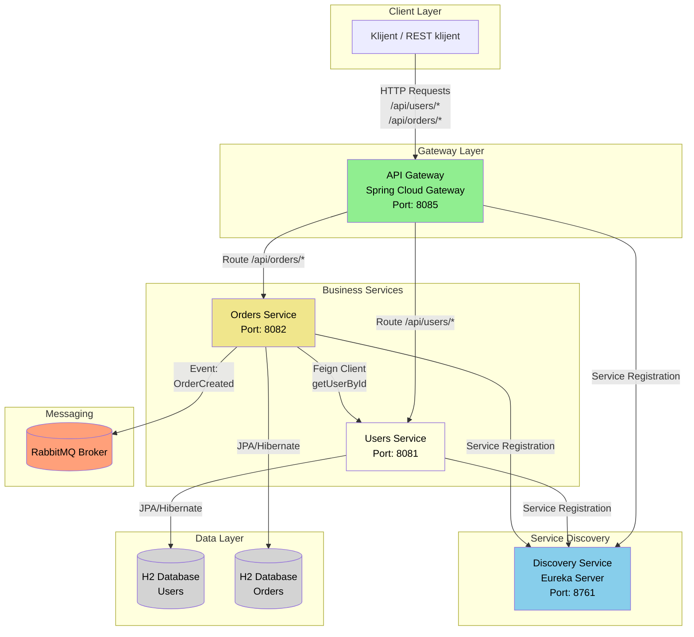

# 🛒 Mini E-Commerce – Mikroservisna Arhitektura

## 📋 Opis projekta
Ovaj projekat predstavlja **mikroservisni sistem** za upravljanje korisnicima i narudžbinama, implementiran pomoću **Spring Boot 3**, **Spring Cloud** i **Resilience4j** biblioteka.  
Cilj je demonstrirati ključne principe **distribuiranih sistema** u Javi:

- ✅ Nezavisni mikroservisi  
- ✅ Service Discovery (Eureka)  
- ✅ API Gateway (centralna ulazna tačka)  
- ✅ Komunikacija između servisa (OpenFeign)  
- ✅ Otpornost sistema (Circuit Breaker + Retry – Resilience4j)  
- ✅ Asinhrona obrada događaja (RabbitMQ – bonus)  

---

## 🏗️ Arhitektura sistema

Sistem je podeljen na četiri glavna modula:

| Modul | Port | Opis |
|--------|------|------|
| **discovery-service** | 8761 | Eureka server – registracija i monitoring servisa |
| **api-gateway** | 8085 | Centralna tačka ulaza – rutiranje zahteva ka servisima, API-key autentifikacija |
| **users-service** | 8081 | CRUD nad entitetom `User`, validacija pomoću Hibernate Validatora |
| **orders-service** | 8082 | CRUD nad `Order` + Feign poziv ka `users-service` + Resilience4j fallback + RabbitMQ događaji |

---

## 🧩 Tehnologije

- **Java 21**  
- **Spring Boot 3.5.6**  
- **Spring Cloud 2025.0.0**  
- **OpenFeign** – komunikacija između servisa  
- **Resilience4j** – Circuit Breaker i Retry mehanizmi  
- **H2 baza** – in-memory baza podataka za jednostavno testiranje  
- **RabbitMQ** – asinhroni događaji („OrderCreated“) *(bonus)*  
- **Spring Cloud Gateway** – rutiranje i API-key autentifikacija  
- **Eureka Discovery Server** – registracija i pronalaženje servisa  
- **JUnit 5 + Spring Boot Test** – integracioni i WebMvc testovi  

---

## 🎨 Dijagram Komponenti



---

## 🗄️ H2 baza – pristup i podaci za prijavu

Svaki mikroservis koristi **H2 in-memory bazu**, koja se automatski briše pri gašenju.  
Da bi joj se pristupilo kroz pregledač potrebno je:

1. Pokrenuti servis (npr. `users-service` ili `orders-service`).
2. Otvoriti sledeći link:  
   - 📍 `http://localhost:8081/h2-console` – za **users-service**  
   - 📍 `http://localhost:8082/h2-console` – za **orders-service**
3. Upisati sledeće podatke:  
   - **Driver Class:** `org.h2.Driver`  
   - **JDBC URL:** `jdbc:h2:mem:usersdb` ili `jdbc:h2:mem:ordersdb`
   - **User Name:** `sa`  
   - **Password:** *(ostaviti prazno)*  
4. Kliknuti **Connect** → biće prikazane tabele (`USER` ili `ORDER`).

---

## 📦 Pokretanje projekta

### 1️⃣ Preduslovi
- Instaliran **JDK 17+**  
- Instaliran **Maven 3.9+**  
- *(Opciono)* instaliran ili pokrenut **RabbitMQ**

---

## 🚀 Pokretanje servisa iz terminala (redosled)

Pokreće se svaki servis iz njegovog foldera komandom `.\mvnw spring-boot:run`.  
Obavezno po sledećem redosledu:

1️⃣ **Pokrenuti Eureka server**
```bash
cd discovery-service
.\mvnw spring-boot:run
```
➡️ Proveriti [http://localhost:8761](http://localhost:8761)

2️⃣ **Pokrenuti users-service**
```bash
cd users-service
.\mvnw spring-boot:run
```
➡️ Biće registrovan u Eureki kao `USERS-SERVICE`.

3️⃣ **Pokrenuti orders-service**
```bash
cd orders-service
.\mvnw spring-boot:run
```
➡️ Registruje se u Eureki i povezuje sa `users-service`.

4️⃣ **Pokrenuti API Gateway**
```bash
cd api-gateway
.\mvnw spring-boot:run
```
➡️ Gateway aktivan na [http://localhost:8085](http://localhost:8085)

---

## 🐇 RabbitMQ – Instalacija, pokretanje i objašnjenje

### 📘 Šta je RabbitMQ?
**RabbitMQ** je message broker koji omogućava asinhronu komunikaciju između servisa pomoću redova poruka (queues).  
U ovom projektu koristi se za slanje događaja kada se kreira nova narudžbina.  
Konkretno:
- Kada se pozove `POST /api/orders`, servis **orders-service** objavi poruku `"OrderCreated"` u red `orders.queue`.
- Drugi deo aplikacije (listener) sluša ovaj red i obrađuje događaj tj loguje informaciju.  

Time se postiže **slaba povezanost (loose coupling)** između komponenti i otpornost sistema.

---

### ⚙️ Instalacija i pokretanje RabbitMQ

#### 💻 Pokretanje RabbitMQ (bez Docker-a)

Ako se koristi **lokalna instalacija RabbitMQ** (bez Docker-a), uraditi sledeće korake:

1. **Instalirati Erlang**  
   RabbitMQ zahteva da je Erlang prethodno instaliran.  
   Preuzeti i instalirati Erlang sa zvaničnog sajta:  
   👉 [https://www.erlang.org/downloads](https://www.erlang.org/downloads)

2. **Instalirati RabbitMQ Server**  
   Preuzeti i instalirati RabbitMQ za Windows sa:  
   👉 [https://www.rabbitmq.com/download.html](https://www.rabbitmq.com/download.html)

3. **Pokrenuti RabbitMQ servis**  
   Nakon instalacije, otvoriti Command Prompt (kao Administrator) i pokrenuti RabbitMQ servis komandom:  
   ```bash
   net start RabbitMQ
   ```

➡️ Nakon pokretanja, otvoriti **Management konzolu** na:  
🔗 [http://localhost:15672](http://localhost:15672)  
- **Username:** guest  
- **Password:** guest  

Tu se može videti queue (`orders.queue`), poruke koje stižu, i broj potrošenih poruka.

#### ✅ Provera rada
1. Pokrenuti RabbitMQ server (Docker ili lokalno).  
2. Pokrenuti sve servise ovog projekta (`orders-service` koristi RabbitMQ).  
3. Pozvati endpoint:
```bash
curl -X POST http://localhost:8085/api/users ^
  -H "Content-Type: application/json" ^
  -H "X-API-KEY: tajni123" ^
  -d "{\"name\":\"Ana\", \"email\":\"ana@example.com\", \"password\":\"Lozinka123\"}"
```
4. Otvoriti **http://localhost:15672** → tab *Queues* → može se videti queue `orders.queue`.  
5. Klikom na njega → pojaviće se poruka `"OrderCreated"`.  
6. Listener u `orders-service` (klasa `OrderEventListener`) će je obraditi i ispisati u log:  
   ```
   📬 [RabbitMQ] Received event: OrderCreated for Order ID: 3
   ```

---

## 🔑 API-key autentifikacija

Gateway zahteva header:  
```
X-API-KEY: tajni123
```

Bez ovog headera biće vraćen `401 Unauthorized`.

---

## 🧠 API rute i primeri

### 👤 Users Service

| Metod | Ruta | Opis |
|-------|------|------|
| `GET /api/users` | Lista svih korisnika |
| `POST /api/users` | Kreiranje novog korisnika |
| `GET /api/users/{id}` | Dohvatanje korisnika po ID-ju |
| `PUT /api/users/{id}` | Ažuriranje korisnika |
| `DELETE /api/users/{id}` | Brisanje korisnika |

**Primer (kreiranje korisnika):**
```bash
curl -X POST http://localhost:8085/api/users ^
  -H "Content-Type: application/json" ^
  -H "X-API-KEY: tajni123" ^
  -d "{\"name\":\"Ana\", \"email\":\"ana@example.com\", \"password\":\"Lozinka123\"}"
```

---

### 🛍️ Orders Service

| Metod | Ruta | Opis |
|-------|------|------|
| `GET /api/orders` | Lista svih narudžbina |
| `POST /api/orders` | Kreiranje narudžbine (proverava `userId` Feign pozivom) i šalje `OrderCreated` događaj u RabbitMQ |
| `GET /api/orders/{id}` | Detalji narudžbine |
| `GET /api/orders/{id}/details` | Agregacija (`Order` + `User` preko Feigna) |
| `DELETE /api/orders/{id}` | Brisanje narudžbine |

**Primer (kreiranje narudžbine):**
```bash
curl -X POST http://localhost:8085/api/orders ^
  -H "Content-Type: application/json" ^
  -H "X-API-KEY: tajni123" ^
  -d "{\"userId\":1, \"productName\":\"Laptop\", \"price\":1200.0}"
```

U logovima će se videti poruka:
```
📦 [OrderEventPublisher] Published event: OrderCreated for Order ID: 1
```

---

## ⚡ Demonstracija otpornosti (Resilience4j)

1. Pokreni sve servise.  
2. Kreiraj korisnika i narudžbinu (kao gore).  
3. **Zaustavi `users-service`** dok `orders-service` ostaje aktivan.  
4. Ponovo pokušaj kreirati narudžbinu.  

📜 U logu `orders-service` pojaviće se:

```
🚨 Fallback triggered! Reason: Users service unavailable — please try again later.
⚡ CircuitBreaker OPEN - users-service unavailable!
```

Servis vraća HTTP 503 (ili fallback JSON odgovor). Nakon 3 pokušaja, CB ostaje otvoren 5 sekundi, zatim prelazi u Half-Open stanje.

---

## 🧪 Testiranje

Pokreni testove iz korena projekta:

```bash
.\mvnw clean test
```

### ✅ Pokriveno:
- **UsersServiceTests** – `@WebMvcTest` (testira validaciju i CRUD)  
- **OrderServiceTests** – servisni test sa Feign simulacijom i CB-Retry logikom  

---

## 🧾 Logovanje

Uključeno je detaljno logovanje:

- Feign pozivi (`INFO`)  
- Resilience4j događaji (`CB_OPEN`, `CB_CLOSED`, `RETRY_ATTEMPT`)  
- RabbitMQ događaji (publish i receive)  

---

## 🧱 Kratka dokumentacija

### Obavezne funkcionalnosti
- ✔ Dva mikroservisa (`users-service`, `orders-service`)  
- ✔ Eureka server i Gateway  
- ✔ Feign komunikacija  
- ✔ Validacija i korektni HTTP statusi  
- ✔ Circuit Breaker + Retry  
- ✔ Agregacioni endpoint (`/orders/{id}/details`)  
- ✔ 2–3 test klase  

### Bonus funkcionalnosti
- 🟢 **RabbitMQ** događaji (“OrderCreated”)  
- 🟢 **API-key** autentifikacija na Gateway-u  

---

### Napomena

**Komunikacija direktno kroz 8081/users i 8082/orders nije omogućena i vratiće uvek 401 unauthorized, omogućeno je da je komunikacija validna samo kroz gateway, tako da će se koristiti samo 8085/api/users i 8085/api/orders.**

---

## ✍️ Autor
**Ime i prezime:** Bojan Kovarbasić  
**Predmet:** Programiranje distribuiranih sistema  
**Godina:** 2025  